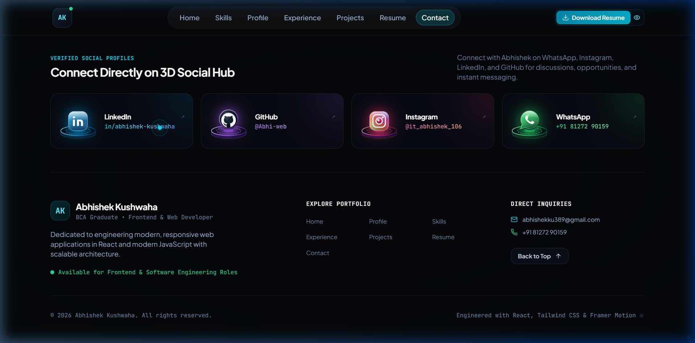

# 🌟 Dual-Domain Professional Portfolio | Abhishek Kushwaha

<div align="center">


<br />

**A state-of-the-art, high-performance dual-track portfolio engineered with React 19, Tailwind CSS, Framer Motion, and lightweight code-based interactive 3D SVG graphics.**

<br />

[](https://wa.me/918127290159)
[](https://www.linkedin.com/in/abhishek-kushwaha-84b2a42b8?)
[](https://github.com/Abhi-web)
[](https://www.instagram.com/it_abhishek_106/)
[](mailto:abhishekku389@gmail.com)

<br />
<br />

### 🛠️ Core Technologies & Tooling
<p align="center">
  
</p>

### 📸 Live Preview: Code-Based 3D Social Hub
<p align="center">
  
</p>

</div>

---

## 📑 Table of Contents

- [Overview](#-overview)
- [Key Features](#-key-features)
- [Code-Based Interactive 3D Graphics](#-code-based-interactive-3d-graphics)
- [Architecture & Tech Stack](#-architecture--tech-stack)
- [Project Directory Structure](#-project-directory-structure)
- [Portfolio Sections Breakdown](#-portfolio-sections-breakdown)
- [Getting Started & Local Development](#-getting-started--local-development)
- [Available Scripts](#-available-scripts)
- [Performance & Accessibility (A11y)](#-performance--accessibility-a11y)
- [Author & Contact Coordinates](#-author--contact-coordinates)
- [License](#-license)

---

## 🚀 Overview

This web portfolio represents the verified professional credentials, academic milestones, and hands-on competencies of **Abhishek Kushwaha** (BCA Graduate, Allenhouse Institute of Technology, Kanpur).

Unlike conventional static portfolios, this application incorporates a **Dual-Domain Switching Architecture** that dynamically restructures the entire portfolio experience between two career pathways:
1. **Frontend & Full-Stack Web Development**: Highlighting React architecture, modern JavaScript (ES6+), REST API integration, Tailwind design systems, and Cloud/DevOps foundations (AWS, Azure, GCP, Docker).
2. **Customer Operations, BPO & Quality Assurance**: Demonstrating SLA compliance, high-empathy customer communication, ticket escalation handling, MS Excel spreadsheet analytics (VLOOKUP, Pivot Tables), and verified industrial Quality Inspection rigor.

---

## 💎 Key Features

- **Dynamic Dual Profile Mode Engine**:
  - Instant one-click switching between `All`, `Technical (Web Dev)`, and `Operations / BPO`.
  - Re-ranks sections, filter tags, metrics, and highlights without page reloads.
  - Context-backed state management via React Context (`ProfileContext`).

- **Code-Based Interactive 3D Icons (Pure SVG + CSS 3D + Framer Motion)**:
  - Eliminates heavy WebGL/Three.js bundles (>1.5MB savings), ensuring blazing-fast load times.
  - Isometric holographic pedestals with glowing neon laser rings, depth extrusions, and ambient radial glow.
  - Floating 3D emblems with smooth continuous micro-bobbing physics and interactive hover elevation.

- **Secret Master Profile Controller**:
  - Stealth recruiter configuration panel accessible via triple-clicking the top-left **AK** logo badge or the secret indicator dot.
  - Allows instant tailoring of visible tracks, experience narratives, and presentation parameters.

- **Interactive Resume Modal & Instant PDF Download**:
  - Clean resume preview modal with dual-mode tabs (Technical vs Operations).
  - One-click ATS-compliant resume download with dynamic file handling.

- **Direct Communication & WhatsApp Hub**:
  - Direct 1-click WhatsApp instant chat integration (`wa.me/918127290159`).
  - Contact form with client-side regex validation, honeypot anti-spam trap, and submission feedback.

- **Glassmorphism & Cyber-Futuristic Dark Theme**:
  - Curated color tokens (Cyan `#06b6d4`, Emerald `#10b981`, Rose `#f43f5e`, Sky `#0284c7`, Purple `#a855f7`).
  - Smooth micro-interactions, gradient borders, and ambient lens blurs.

---

## 🎨 Code-Based Interactive 3D Graphics

All 3D components in this application are built entirely with **Vector SVG Geometry**, **CSS 3D Transforms**, and **Framer Motion Micro-Physics**:

| Component | Target Location | Description |
|---|---|---|
| **`AK3DIcon`** | Navbar & Hero Badge | Holographic pedestal with glowing cyan laser ring, floating 3D "AK" monogram badge, and active emerald online status beacon. |
| **`Social3DIcon`** | Footer & Contact Hub | Custom 3D pedestals with floating emblems for **WhatsApp** (green speech bubble + handset), **Instagram** (glossy camera), **LinkedIn** (blue cube), and **GitHub** (Octocat sphere). |
| **`Skill3DIcon`** | Skills Matrix | Interactive 3D holographic icons for React, JavaScript, HTML5, CSS3, Node.js, Express, MongoDB, AWS, Azure, Google Cloud, Docker, Cloud Deployment, Git, and MS Office. |
| **`Competency3DIcon`** | Areas of Impact | Dedicated 3D graphics for Web Dev terminal, UI Design palette, Customer Support headset, Omnichannel Mail/Chat, Security Shield, and Spreadsheet Grid. |
| **`About3DIcon`** | Core Foundations | 3D Graduation Cap & Diploma (Academics), Code Terminal (Engineering), Headset (Client Service), and Target Radar (Objectives). |
| **`BPO3DIcon`** | Professional Strengths | 11 custom 3D isometric icons covering active listening, escalation handling, email communication, chat multitasking, data accuracy, and rotational adaptability. |

---

## 🛠️ Architecture & Tech Stack

```
Frontend Architecture
 ├── Core Framework: React 19.2 (Functional Components & Hooks)
 ├── Build Tool: Vite 8.3 (Lightning-fast HMR & Optimized Bundling)
 ├── Styling & Design System: Tailwind CSS 3.4 (Custom Design Tokens)
 ├── Animation Engine: Framer Motion 14.0 (Spring Physics & Orchestration)
 ├── Iconography: Lucide React 1.51 + Custom Code-Based 3D SVGs
 ├── Special Effects: Canvas Confetti (Celebration Triggers)
 ├── State Management: React Context API (ProfileContext)
 └── Code Quality: Oxlint
```

---

## 📁 Project Directory Structure

```
my-portfolio/
├── public/                     # Static assets, favicon, resume PDFs
├── src/
│   ├── components/             # Modular React components
│   │   ├── About/              # Personal journey, education, and 3D foundation cards
│   │   │   ├── About.jsx
│   │   │   └── About3DIcon.jsx # 3D icons for Academics, Engineering, Support, Objectives
│   │   ├── BPOStrengths/       # 11 in-depth BPO & Operations competency cards
│   │   │   ├── BPOStrengths.jsx
│   │   │   └── BPO3DIcon.jsx   # 3D holographic icons for each BPO strength
│   │   ├── Contact/            # Communication form, validated inputs, channels
│   │   │   └── Contact.jsx
│   │   ├── Experience/         # Verified industrial experience & roles
│   │   │   └── Experience.jsx
│   │   ├── Footer/             # Footer, 3D Social Hub, and stealth switch
│   │   │   └── Footer.jsx
│   │   ├── Hero/               # Hero headline, dynamic CTA, proof metrics
│   │   │   ├── Hero.jsx
│   │   │   └── HeroVisual.jsx  # Interactive profile card with AK 3D icon
│   │   ├── Navbar/             # Fixed responsive navigation, 3D AK logo
│   │   │   └── Navbar.jsx
│   │   ├── Projects/           # Filterable technical projects & modal views
│   │   │   ├── Projects.jsx
│   │   │   ├── ProjectModal.jsx
│   │   │   └── FeaturedProject.jsx
│   │   ├── Resume/             # Interactive resume preview modal
│   │   │   └── ResumeModal.jsx
│   │   ├── Services/           # Personal capabilities & Areas of Impact
│   │   │   ├── Services.jsx
│   │   │   └── Competency3DIcon.jsx # 3D icons for 6 core service capabilities
│   │   ├── Skills/             # Comprehensive technical & operational skills
│   │   │   ├── Skills.jsx
│   │   │   └── Skill3DIcon.jsx # 3D holographic icons for all skill categories
│   │   └── common/             # Reusable design system components
│   │       ├── AK3DIcon.jsx    # Monogram personal brand 3D icon
│   │       ├── BrandIcons.jsx  # Scalable vector brand components
│   │       ├── IconRenderer.jsx# Dynamic Lucide icon mapper
│   │       ├── ProfileSwitcher.jsx # Mode selector pills
│   │       ├── SectionHeading.jsx  # Standardized animated section header
│   │       ├── SecretMasterController.jsx # Secret stealth control panel
│   │       └── Social3DIcon.jsx# 3D Social cards & holographic pedestals
│   ├── context/
│   │   └── ProfileContext.jsx  # Global mode & presentation state provider
│   ├── data/                   # Single Source of Truth configuration files
│   │   ├── bpoStrengths.js     # 11 operational competencies & metrics
│   │   ├── contact.js          # Verified phone, email, location & channels
│   │   ├── experience.js       # Verified QC & Data Entry employment history
│   │   ├── profile.js          # Core bio, academic degree, and philosophy
│   │   ├── profileModes.js     # Mode-specific headlines and proof badges
│   │   ├── projects.js         # Production web applications & live URLs
│   │   ├── resume.js           # Full ATS-optimized resume schema
│   │   ├── services.js         # Deliverables, service tracks, and capabilities
│   │   ├── skills.js           # Skills categorized with proficiency levels
│   │   └── socials.js          # Verified social handles (GitHub, WhatsApp, etc.)
│   ├── hooks/                  # Custom reusable React hooks
│   │   ├── useReducedMotion.js # Accessibility hook respecting user preferences
│   │   └── useResume.js        # Dynamic resume view & download handler
│   ├── services/
│   │   ├── contactService.js   # Client-side message simulation & delivery
│   │   └── dataService.js      # Centralized data access abstraction
│   ├── utils/
│   │   ├── contactAnalytics.js # Privacy-friendly recruiter event tracking
│   │   └── motion.js           # Standardized Framer Motion animation presets
│   ├── App.jsx                 # Master application component layout
│   ├── index.css               # Core Tailwind directives & glassmorphic utilities
│   └── main.jsx                # Application root mounting
├── index.html                  # HTML5 shell with OpenGraph meta & fonts
├── package.json                # Project dependencies and npm scripts
├── tailwind.config.js          # Extended color palettes, blurs & keyframes
└── vite.config.js              # Vite compiler plugins and optimization flags
```

---

## 🔍 Portfolio Sections Breakdown

1. **Navbar (`#home`)**:
   - Fixed header with backdrop blur and active section tracking.
   - Interactive 3D **AK** monogram logo with online indicator and secret controller trigger.
2. **Hero Section (`#home`)**:
   - High-impact positioning headline adapting to candidate profile mode.
   - Dual-track proof metrics bar and quick CTA buttons (View Resume, GitHub, Contact).
   - Interactive profile card with live status chip and 3D badge.
3. **About Section (`#about`)**:
   - Narrative overview of academic background (BCA) and core foundations.
   - 4 Modular Cards featuring interactive 3D icons: *Academics*, *Engineering*, *Client Service*, and *Objectives*.
   - Career philosophy items with pulse markers.
4. **Skills Matrix (`#skills`)**:
   - Categorized across *Frontend*, *Backend & Database*, *Cloud & DevOps*, *Core CS*, *Operational & BPO*, and *Quality & Records*.
   - Interactive 3D holographic icons on every skill card with hover physics.
5. **Career Profile & Experience (`#experience`)**:
   - Verified industrial track record:
     - **Quality Inspector** at *Balaji Enterprises* (7 Months).
     - **Data Entry Specialist** at *Bhavani Enterprise* (4 Months).
   - Comprehensive SLA adherence, tooling, and quantifiable deliverables.
6. **Web Projects Showcase (`#projects`)**:
   - Filterable projects with live demos, source code repositories, architecture overviews, and interactive modals.
7. **Professional Strengths (`#professional-strengths`)**:
   - 11 In-depth operational capability cards with code-based 3D icons, metrics, and business value propositions.
8. **Areas of Impact & Competencies (`#services`)**:
   - 6 Core personal capabilities with 3D holographic icons and tangible deliverable checklists.
9. **Interactive Resume (`#resume-preview`)**:
   - Tabbed ATS resume preview modal with direct download button.
10. **Contact Hub (`#contact`)**:
    - Direct communication channels (Email, Phone, WhatsApp, LinkedIn, GitHub, Instagram).
    - Validated interactive contact form with honeypot spam protection.
11. **Footer & 3D Social Hub**:
    - Dedicated **Connect with Abhishek** 3D Social Hub row with 4 interactive 3D cards: **WhatsApp**, **Instagram**, **LinkedIn**, and **GitHub**.

---

## 💻 Getting Started & Local Development

### Prerequisites

Ensure you have [Node.js](https://nodejs.org/) (v18.0.0 or higher) and [npm](https://www.npmjs.com/) installed on your system.

### 1. Clone the Repository

```bash
git clone https://github.com/Abhi-web/my-dual-Portfolio.git
cd my-dual-Portfolio
```

### 2. Install Dependencies

```bash
npm install
```

### 3. Launch Development Server

```bash
npm run dev
```

Open [http://localhost:5173](http://localhost:5173) in your browser to view the application with Hot Module Replacement (HMR).

### 4. Build for Production

To create an optimized, minified production bundle:

```bash
npm run build
```

The production assets will be output to the `dist/` directory.

### 5. Preview Production Build Locally

```bash
npm run preview
```

---

## ⚡ Available Scripts

| Command | Action |
|---|---|
| `npm run dev` | Starts Vite local development server with instant HMR on port `5173`. |
| `npm run build` | Compiles production bundle with tree-shaking and asset optimization. |
| `npm run preview` | Spins up a local static server serving the production `dist/` folder. |
| `npm run lint` | Runs `oxlint` for high-performance JavaScript/JSX linting. |

---

## ♿ Performance & Accessibility (A11y)

- **Performance**:
  - Zero heavy 3D rendering engines (no Three.js or canvas overhead); uses lightweight, mathematically optimized SVGs.
  - Achieves consistent **60 FPS** animations and fast initial load times.
- **Accessibility**:
  - Respects OS-level `prefers-reduced-motion` settings via `useReducedMotion`.
  - Accessible ARIA labels and semantic heading hierarchy (`h1`-`h5`).
  - Mobile touch targets adhere to WCAG standards (minimum 44x44px).
  - High-contrast color ratios across dark mode surfaces.

---

## 📬 Author & Contact Coordinates

**Abhishek Kushwaha**  
*BCA Graduate • Frontend Web Developer & Operations / Support Specialist*  
*Allenhouse Institute of Technology, Kanpur*

- 🌐 **GitHub**: [@Abhi-web](https://github.com/Abhi-web)
- 💼 **LinkedIn**: [in/abhishek-kushwaha](https://www.linkedin.com/in/abhishek-kushwaha-84b2a42b8?)
- 💬 **WhatsApp**: [+91 81272 90159](https://wa.me/918127290159)
- ✉️ **Email**: [abhishekku389@gmail.com](mailto:abhishekku389@gmail.com)
- 📸 **Instagram**: [@it_abhishek_106](https://www.instagram.com/it_abhishek_106/)

---

## 📄 License

This project is licensed under the [MIT License](LICENSE) — feel free to use and adapt this code with proper attribution.

<div align="center">
  <sub>Engineered with ❤️ by Abhishek Kushwaha • React 19 • Tailwind CSS • Framer Motion</sub>
</div>
